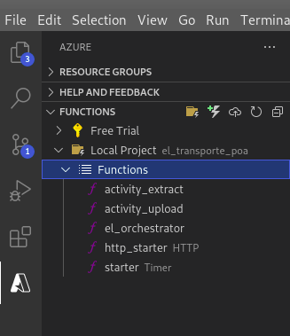

# Extract and Load procedure 

The current repo is a simple extract and load procedure mounted on an Azure Functions structure. Since it doesn't cover the transform step of a classic ELT pipeline, this app simply downloads the entire data of a chosen public API (no credentials required) and stores it in a storage container. 

# installation

The step by step installation guide will cover the installation trough VSCode integration with Azure Functions. For a guide on development environment setup, please, follow the steps on [this tutorial](https://docs.microsoft.com/en-us/azure/azure-functions/functions-develop-vs-code?tabs=python). After completing the tutorial, you will be ready to install the **el_transportes_poa**.

## Clone repository
Create and open a folder in VSCode. Open the terminal in VSCode and clone the repository to the current folder:

```python
git clone https://github.com/eduardo-prjadko/el_transportes_poa.git .
```
## Upload to Azure Functions
In the Azure Functions extension tab, refresh the functions workspace so that the extension can identfy the project on the *Local Project* folder.
<br>

<br>
Deploy the local project, as it is, to an existing function or create a new, following the instructions in VSCode.

## Setup the environment variables
The required environment variables for the app are two:
* URL - the endpoit where data will be downloaded.
* CONTAINER - the name of the azure storage container where data will be saved. There is no need the create previously the container, since the app automatocally creates it.